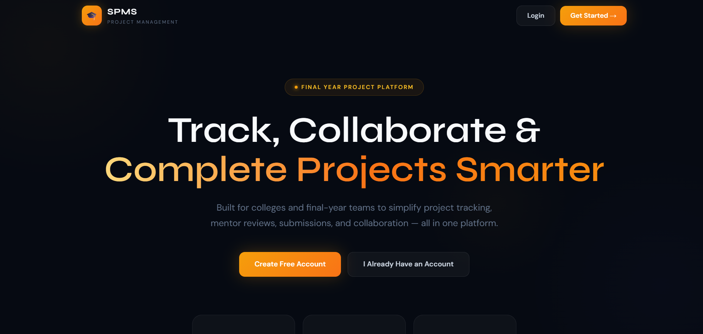
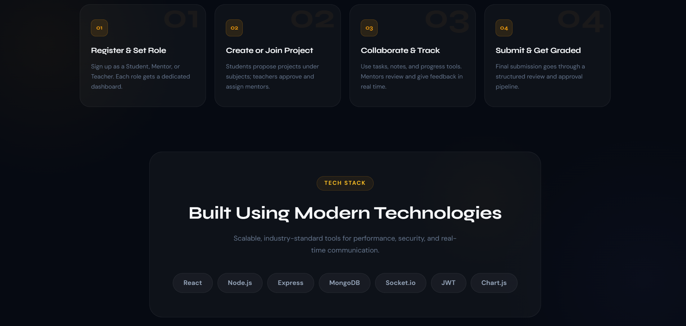

# SPMS — Student Project Management System

Full-stack academic project management platform with **role-based access** (Student, Mentor, Teacher), real-time features, file submissions, Kanban tasks, team chat, analytics, and admin panel.

## Tech Stack

| Layer | Technologies |
|-------|----------------|
| Frontend | React 19, Vite, React Router, Axios, Socket.io-client, Chart.js, Tailwind CSS |
| Backend | Node.js, Express 5, MongoDB, Mongoose, JWT, Socket.io, Multer |
| Auth | bcrypt + JWT Bearer tokens |

## Features (v3.0)

- **Authentication** — Register/Login with role-specific profiles
- **Projects** — CRUD, approval workflow, grading (A+ to F)
- **Submissions** — File upload (up to 20MB) with version tracking
- **Teams** — Create team, add/remove members with roles
- **Real-time Chat** — Socket.io + MongoDB message history
- **Kanban Board** — Tasks stored in database per project
- **Subjects & Requests** — Students request teacher assignment
- **Notifications** — In-app + real-time toast via Socket.io
- **Analytics** — Chart.js dashboards
- **Leaderboard** — Server-side points calculation
- **Admin Panel** — Teacher overview, user management

## Project Structure

```
student-project-management/
├── backend/          # REST API + Socket.io
├── frontend/         # React SPA
└── README.md
```

## Setup Instructions

### Prerequisites

- Node.js 18+
- MongoDB running locally or Atlas URI

### 1. Backend

```bash
cd backend
cp .env.example .env
# Edit .env — set MONGO_URI and JWT_SECRET
npm install
npm run dev
```

Server: `http://localhost:5000`

### 2. Frontend

```bash
cd frontend
cp .env.example .env
npm install
npm run dev
```

App: `http://localhost:5173`

### 3. Demo Flow (for viva/demo)

1. Open `/` — Landing page with features
2. Register as **Student** → create project → create team
3. Register as **Teacher** → approve projects, add subjects, grade
4. Student: Assign Teacher, Kanban, Team Chat, Submissions

## API Endpoints (summary)

| Method | Endpoint | Description |
|--------|----------|-------------|
| POST | `/api/auth/register` | Register user |
| POST | `/api/auth/login` | Login + JWT |
| GET | `/api/projects` | List projects (role-filtered) |
| POST | `/api/submissions` | Upload submission (multipart) |
| GET | `/api/tasks/project/:id` | Kanban tasks by project |
| GET | `/api/messages/team/:id` | Chat history |
| GET | `/api/stats/leaderboard` | Leaderboard rankings |
| GET | `/api/admin/overview` | Admin dashboard (teacher) |
| GET | `/api/health` | Health check |

## Architecture

```
Browser (React)
    │  REST (Axios + JWT)
    ▼
Express API ──► MongoDB
    │
    └── Socket.io (chat, notifications)
```

## Author

Academic / Final Year Project — Student Project Management System (SPMS)



